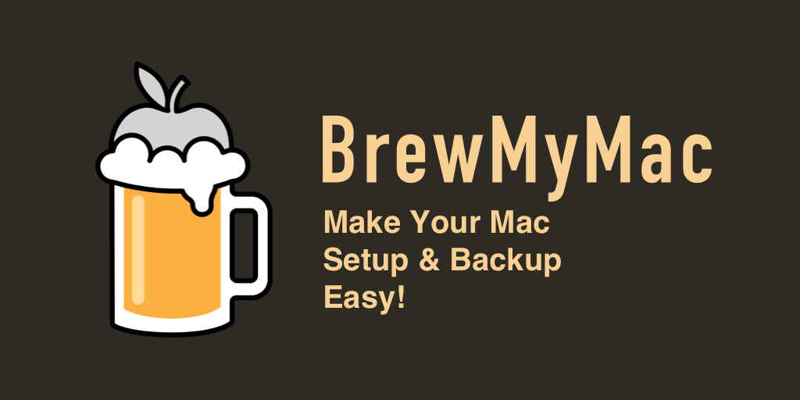

# 🍻 BrewMyMac -- 自动化备份 & 安装 macOS 应用程序

## 🤖️ 安装

### 方便快捷

1. `fork` 此项目
2. 通过 `git clone` 克隆 `fork` 后的项目到本地，克隆至 `~` 用户目录下

### 精神洁癖

1. 自创一个同名的私有 GitHub 项目，本地存储在 `~` 目录下
2. 下载本项目代码，重新上传至自己的私有项目

## 🧾 备份列表 (在 `backup` 文件夹下)

- `formulae.list`: brew 安装的 package 列表，如 `python`, `mysql`
- `cask.list`: brew 安装的 GUI 程序列表，如 `WeChat`, `Surge`
- `application.list`: `/Application` 目录下的程序备份列表，用于还原备份后提醒用户还有哪些 App 需要手动安装 (默认不存在)
- `setapp.list`: SetApp 程序备份列表 (如果你使用 SetApp)
- `not_install_app.list`: 没通过 brew 安装的应用程序列表，可以用于手动 app 安装时参照

P.S. 部分常用程序已写入 `formulae.list` 和 `cask.list`

## 👀 使用

### 🍺 通过 Homebrew 自动安装

#### 无备份列表

1. 将安装的程序添加到列表，假如你已有列表备份，可以直接执行下一步的安装
   列表在 `backup` 文件夹下：
    - 命令行程序 `formulae.list`
    - GUI 程序 `cask.list`
2. 运行 `./brew_my_mac.sh` 脚本进行安装

#### 有备份列表

1. 直接运行 `./brew_my_mac.sh`  脚本进行安装即可
2. 运行完成后，`not_install_app.list` 会列出需要自行手动安装的 App;
3. SetApp 用户可以查看 `backup/setapp.list` 获取备份的 SetApp 程序列表，自行完成安装

### 📦 自动备份程序列表
⚠️ 使用前请务必先 `fork` 本项目！并配置好本地的 `Git` 环境

#### 安装

1. 运行 `./backup.sh`，查看手动备份脚本能否正常运行
2. 上一步的脚本运行正常无误后，再运行 `./install_backup.sh` 完成自动备份脚本的安装

#### 原理
调用 `crontab` 每日 12:00 PM 自动执行 `backup.sh`

`backup.sh` 将生成程序列表，通过 `git commit` 的方式同步到你自己的 GitHub 项目下

#### 手动备份方式
运行 `./backup.sh`

## 🤔 关于本项目
原项目地址 (作者已停止维护): https://github.com/jsycdut/mac-setup

### 为什么要更新

由于 `Homebrew` 更新后，`brew cask install` 整合到 `brew install` 中，原项目的旧脚本运行失败

## ☕️ 喝杯咖啡?

ETH 主网: `jsmjsm.eth`
